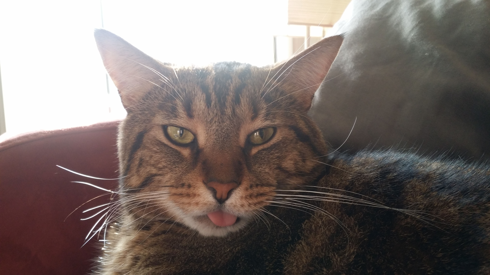

# hello-github
## GitHub Test ##
Having fun times with [markdown](http://daringfireball.net/projects/markdown/syntax) syntax...

I love...
* Items!
* More items!
* MOAR ITEMS
  * Subitems?

Here's what my cat thinks about my experiments:

